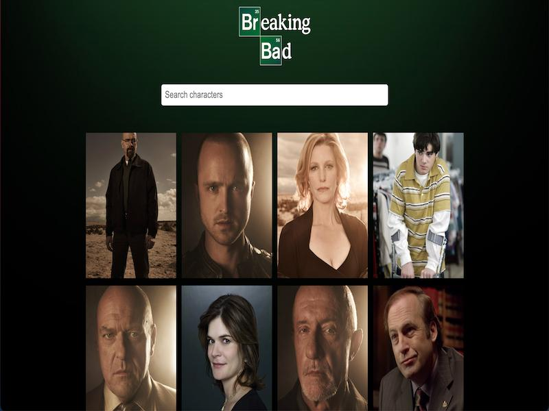

# Breaking Bad Api React App



React Project that uses [breaking bad api](https://breakingbadapi.com/documentation) to show and filter the cast of the show.

This project was built following [Brad Traversy's](https://github.com/bradtraversy) [YouTube](https://www.youtube.com/watch?v=YaioUnMw0mo&ab_channel=TraversyMedia) tutorial.

Brad has an awesome YouTube channel which is a great resource of inspiration and guidance for any coding newbie in the world of front-end development.

## Usage

### Instalation

Install dependencies:

```
npm install
```

Compile the code for development and start a local server:

```
npm run start
```

Create the build:

```
npm run build
```

### Credits

[Brad Traversy](https://github.com/bradtraversy)

### Learn More

You can learn more in the [Create React App documentation](https://facebook.github.io/create-react-app/docs/getting-started).

To learn React, check out the [React documentation](https://reactjs.org/).

### License

[MIT](License)

Made with :green_heart: by [Mike Gajdos](https://github.com/MikeGajdos)
